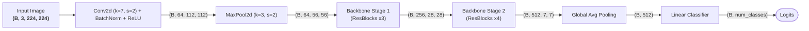

```mermaid
flowchart LR
    Img["Input Image<br/><b>(B, 3, 224, 224)</b>"] 
    --> Conv1["Conv2d (k=7, s=2) + BatchNorm + ReLU"]
    
    Conv1 -->|" (B, 64, 112, 112) "| Pool1["MaxPool2d (k=3, s=2)"]
    
    Pool1 -->|" (B, 64, 56, 56) "| BB1["Backbone Stage 1<br/>(ResBlocks x3)"]
    
    BB1 -->|" (B, 256, 28, 28) "| BB2["Backbone Stage 2<br/>(ResBlocks x4)"]
    
    BB2 -->|" (B, 512, 7, 7) "| GAP["Global Avg Pooling"]
    
    GAP -->|" (B, 512) "| Head["Linear Classifier"]
    
    Head -->|" (B, num_classes) "| Out([Logits])
```
