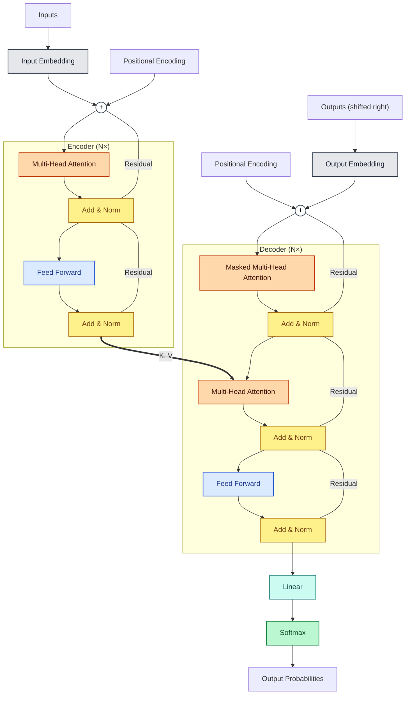

```mermaid
flowchart TD
    %% ==========================================
    %% ĐỊNH NGHĨA STYLE MÀU SẮC CHUẨN PAPER GỐC
    %% ==========================================
    classDef emb fill:#e5e7eb,stroke:#374151,stroke-width:1.5px,color:#111827;
    classDef attn fill:#fed7aa,stroke:#c2410c,stroke-width:1.5px,color:#431407;
    classDef ffn fill:#dbeafe,stroke:#1d4ed8,stroke-width:1.5px,color:#1e3a8a;
    classDef norm fill:#fef08a,stroke:#a16207,stroke-width:1.5px,color:#713f12;
    classDef head fill:#ccfbf1,stroke:#0f766e,stroke-width:1.5px,color:#134e4a;
    classDef out fill:#bbf7d0,stroke:#15803d,stroke-width:1.5px,color:#14532d;
    classDef op fill:#ffffff,stroke:#374151,stroke-width:1.5px,color:#111827;
    classDef ghost fill:none,stroke:none;

    %% ==========================================
    %% 1. NHÁNH ENCODER (BÊN TRÁI)
    %% ==========================================
    EncIn["Inputs"]
    EncEmb["Input Embedding"]:::emb
    EncPE["Positional Encoding"]
    EncAdd((+)):::op

    EncIn --> EncEmb --> EncAdd
    EncPE --> EncAdd

    subgraph EncStack ["Encoder (N×)"]
        EncMHA["Multi-Head Attention"]:::attn
        EncNorm1["Add & Norm"]:::norm
        EncFFN["Feed Forward"]:::ffn
        EncNorm2["Add & Norm"]:::norm

        EncMHA --> EncNorm1 --> EncFFN --> EncNorm2
    end

    EncAdd --> EncMHA
    EncAdd ---|Residual| EncNorm1
    EncNorm1 ---|Residual| EncNorm2


    %% ==========================================
    %% 2. NHÁNH DECODER (BÊN PHẢI)
    %% ==========================================
    DecIn["Outputs (shifted right)"]
    DecEmb["Output Embedding"]:::emb
    DecPE["Positional Encoding"]
    DecAdd((+)):::op

    DecIn --> DecEmb --> DecAdd
    DecPE --> DecAdd

    subgraph DecStack ["Decoder (N×)"]
        DecMMHA["Masked Multi-Head Attention"]:::attn
        DecNorm1["Add & Norm"]:::norm
        DecMHA["Multi-Head Attention"]:::attn
        DecNorm2["Add & Norm"]:::norm
        DecFFN["Feed Forward"]:::ffn
        DecNorm3["Add & Norm"]:::norm

        DecMMHA --> DecNorm1 --> DecMHA --> DecNorm2 --> DecFFN --> DecNorm3
    end

    DecAdd --> DecMMHA
    DecAdd ---|Residual| DecNorm1
    DecNorm1 ---|Residual| DecNorm2
    DecNorm2 ---|Residual| DecNorm3


    %% ==========================================
    %% 3. ĐẦU RA (OUTPUT HEAD)
    %% ==========================================
    DecLinear["Linear"]:::head
    DecSoftmax["Softmax"]:::out
    DecOut["Output Probabilities"]

    DecNorm3 --> DecLinear --> DecSoftmax --> DecOut


    %% ==========================================
    %% 4. CROSS-ATTENTION (ENCODER SANG DECODER)
    %% ==========================================
    EncNorm2 ==>|K, V| DecMHA
```
